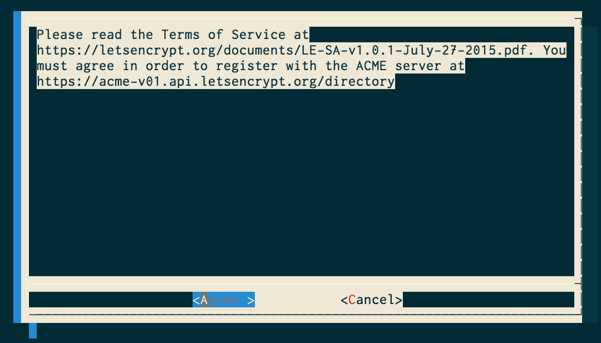
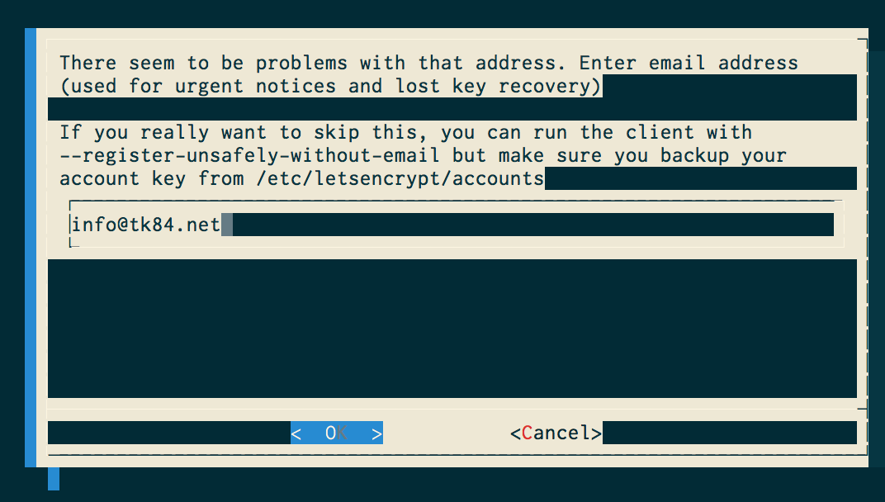

# Let's Encrypt で SSL証明書を取得する

Let's Encrypt を使うと無料でSSL証明書を取得できます。  
このブログのHTTPS化をするにあたり、「Let's Encrypt」でSSL証明書を取得してみました。


## インストール

参考) https://letsencrypt.readthedocs.org/en/latest/using.html

### Running with Docker

Let's Encrypt にはDockerを使用したインストール方法が用意されています。  
HTTPS化を行いたいWebサーバがDockerでホスティングされているのであれば手っ取り早く試してみることができます。

公式の方法ではDockerホストに証明書ファイルが作成されるため一部手順を変更しています。

### コンテナを起動

SSLを取得したいドメインの参照するサーバでコンテナを起動します。  
このコンテナはポート `80,443` を使用しますので既に別コンテナでサイトが稼働している場合には一旦ストップする[^1]必要があります。  
また、新しくHTTPS化を行う場合には443ポートをWebサーバの稼働しているホストにマッピングしておくことをお忘れなく。

```
$ docker run -it --rm -p 10443:443 -p 80:80 --name letsencrypt \
    --entrypoint bash \
    quay.io/letsencrypt/letsencrypt:latest -i
```

### SSL取得

docker run で立ち上げたcontainer上でコマンドを実行していきます。

```
$ letsencrypt certonly
```







```
IMPORTANT NOTES:
 - If you lose your account credentials, you can recover through
   e-mails sent to info@tk84.net.
 - Congratulations! Your certificate and chain have been saved at
   /etc/letsencrypt/live/blog.tk84.net/fullchain.pem. Your cert will
   expire on 2016-03-27. To obtain a new version of the certificate in
   the future, simply run Let's Encrypt again.
 - Your account credentials have been saved in your Let's Encrypt
   configuration directory at /etc/letsencrypt. You should make a
   secure backup of this folder now. This configuration directory will
   also contain certificates and private keys obtained by Let's
   Encrypt so making regular backups of this folder is ideal.
 - If you like Let's Encrypt, please consider supporting our work by:

   Donating to ISRG / Let's Encrypt:   https://letsencrypt.org/donate
   Donating to EFF:                    https://eff.org/donate-le
```

端末の設定なのかグラフィカルなUIがちょっと壊れていますが大丈夫でした。  
新規取得時には利用規約に承諾してメールアドレスを入力する必要があるようです。  
ドメインを二回入力する必要がありましたがSSLを取得できました。

### 証明書ファイルをコピー

container上に出来上がった証明書ファイルをクライアントマシンにコピーします。

```
$ docker cp letsencrypt:/etc/letsencrypt letsencrypt
```

```
$ tree letsencrypt/archive
letsencrypt/archive
└── blog.tk84.net
    ├── cert1.pem
    ├── chain1.pem
    ├── fullchain1.pem
    └── privkey1.pem

1 directory, 4 files
```

`fullchain1.pem`がサーバ証明書、`privkey1.pem`が秘密鍵になります。


[^1]: Webサーバを停止させずに取得することもできるようです。 https://http2.try-and-test.net/letsencrypt.html
