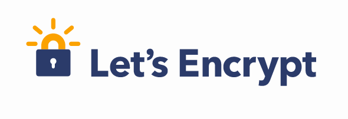

# 複数のDockerコンテナをリバースプロキシでルーティングし、SSL証明書の取得まで簡単に自動化する

```
$ docker run -d -p 80:80 -v /var/run/docker.sock:/tmp/docker.sock:ro dmp1ce/nginx-proxy-letsencrypt
```

こうして

```
$ docker run -e VIRTUAL_HOST=foo.bar.com  ...
```

こうするだけ

ルーティングしたいコンテナを起動するときに`VIRTUAL_HOST`という環境変数を設定し、
[nginx-proxy-letsencrypt][1]という、リバースプロキシとSSL取得の自動化を行ってくれるイメージを起動するだけです。


## リバースプロキシーの設定って面倒だよね…

同じサーバで複数のWebアプリをドメインを切り替えて80番ポートで利用する。
リバースプロキシーを設定するのが手間
SSL証明書の取得が手間である

## SSL証明書の取得&設定って面倒だよね…

dockerでコンテナ間をリンクする方法だとcontainerをrestartするとIPが変わる
その都度関係するcontainerを再起動する必要がある



SSL証明書を用意しないくていい

## Let's Encrypt
## nginx proxy for Docker

当該ドメインで稼働中のwebサーバに認証用のファイルを置いておく必要がある

チェックシーケンス
- 当該ドメインのルートディレクトリにアクセス
- 認証情報をチェック

自動的に認証のファイルを生成してくれる


コンテナの起動の順番はどちらでも構わない
また、コンテナ再起動時にはアプリのコンテナのIPを自動で再設定してくれる


要検証
letsencryptの証明書は90日だけど、これは自動でやってくれるの？


## 参考
- [dmp1ce/nginx-proxy-letsencrypt][1]
- [Let’s Encrypt サーバー証明書の取得と自動更新設定メモ | あぱーブログ](https://blog.apar.jp/linux/3619/)

[1]:(https://hub.docker.com/r/dmp1ce/nginx-proxy-letsencrypt/ "Docker Hub)